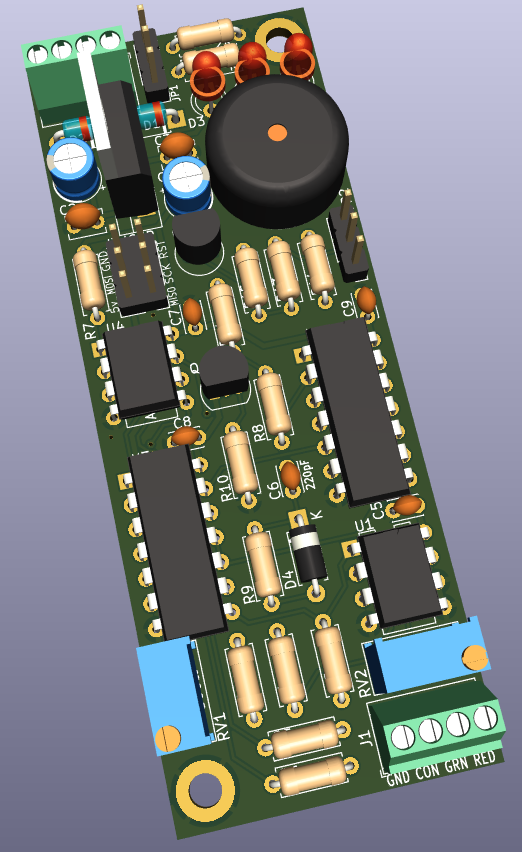

# CNC Probe Interface
A resistance switching interface board for CNC probes

Work In Progress - the [Mostly Printed Probe](https://github.com/Stutchbury/MostlyPrintedProbe) was a distracting, but necessary side project.

